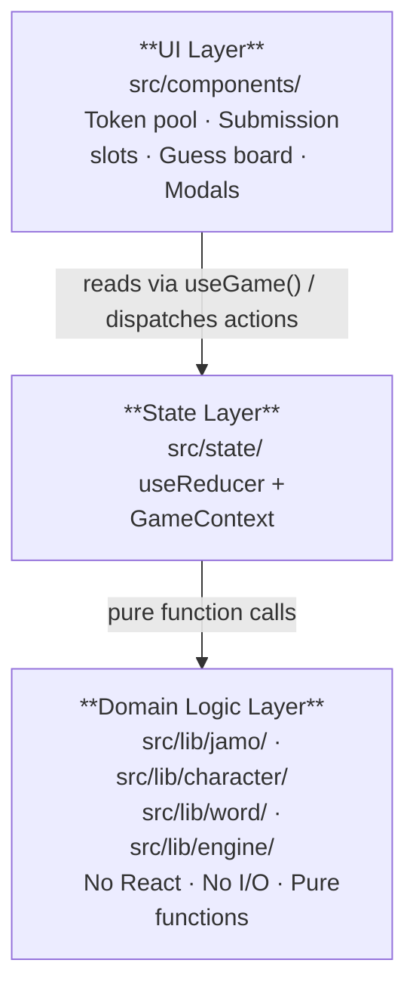

# Architecture

Fully client-side, statically-hosted single-page PWA. No backend. No authentication. No runtime network calls except asset loading and the service worker cache.

## Layers

**`src/lib/jamo/`** — Unicode mechanics: rotation, jamo combination, syllable composition/decomposition. See `src/lib/jamo/README.md`.

**`src/lib/character/`** — The `Character` slot model and its operations. Bridge between raw jamo and the player-visible assembly state. See `src/lib/character/README.md`.

**`src/lib/word/`** — Word type, pool derivation, word loading and selection. The only layer that performs I/O. See `src/lib/word/README.md`.

**`src/lib/engine/`** — Guess validation, evaluation, and scoring. See `src/lib/engine/README.md`.

**`src/state/`** — Single `useReducer` + `GameContext`. Reducer enforces valid state transitions; engine computes what they mean. See `src/state/README.md`.

**`src/components/`** — Renders state, dispatches actions. No business logic. See `src/components/README.md`.

## Stack

| Concern            | Choice                    | Rationale                                                                                |
| ------------------ | ------------------------- | ---------------------------------------------------------------------------------------- |
| UI framework       | React 19 + React Compiler | Compiler handles memoization automatically — no speculative `useMemo`/`useCallback`      |
| Styling            | Tailwind CSS v4           | Utility-first, co-located with markup; v4 config-free setup                              |
| Build + dev server | Vite                      | Fast HMR; `vite-plugin-pwa` handles service worker generation                            |
| Language           | TypeScript strict         | Catches invalid jamo/slot combinations at compile time                                   |
| Unit tests         | Vitest                    | Co-located with source; compatible with Vite config                                      |
| E2E tests          | Playwright                | Full browser interaction; tests observable UI behaviour                                  |
| Linting            | oxlint                    | Rust-based, fast, ESLint-compatible rules                                                |
| Formatting         | oxfmt                     | Rust-based, Prettier-compatible                                                          |
| Package manager    | pnpm                      | Enforced project-wide                                                                    |
| Git hooks          | simple-git-hooks          | Lightweight; format → restage → lint → typecheck on commit                               |
| Hosting            | GitHub Pages + Actions    | Matches no-backend constraint; no `gh-pages` branch — Pages source set to GitHub Actions |
